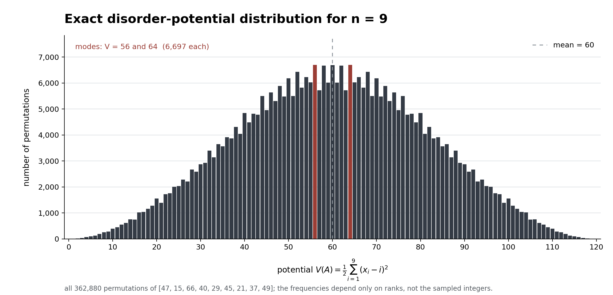

# Disorder potential across random permutations

The [first paper](../../disorder_potential_search_note_v2.pdf) measures how far an array is from sorted order using the ranks of its entries. The experiment here starts with nine distinct random integers and enumerates every ordering of them. The integers are just labels: once all orderings are included, only their ranks matter.

For $n=9$, there are $9!=362{,}880$ orderings and every integer potential from $0$ through $120$ occurs. The mean is $60$. The two most frequent potentials are $56$ and $64$, with $6{,}697$ orderings each. The [PDF plot](potential_histogram.pdf), [exact counts with one example per potential](potential_counts.csv), and [reproduction script](plot_potential_n9.py) are in this folder.

## The distribution for general $n$

Let $\pi=(\pi_1,\ldots,\pi_n)$ be a uniformly random permutation of the ranks $1,\ldots,n$. The potential is

$$
V_n(\pi)=\frac{1}{2}\sum_{i=1}^{n}(\pi_i-i)^2
=\sum_{i=1}^{n}i^2-\sum_{i=1}^{n}i\pi_i.
$$

The second form makes this a sum over a random permutation. Its mean and variance are exact:

$$
\mu_n=\frac{n(n^2-1)}{12},
\qquad
\sigma_n^2=\frac{n^2(n-1)(n+1)^2}{144}.
$$

There is exact symmetry as well. Replacing each rank $\pi_i$ by $n+1-\pi_i$ pairs every ordering with one on the opposite side of the mean:

$$
V_n(\pi)+V_n(n+1-\pi)=\frac{n(n^2-1)}{6}=2\mu_n.
$$

This explains the symmetry in the plot. It does not make the finite distribution exactly normal: the $n=9$ histogram has two modes. As $n$ grows, the standardized potential approaches a normal distribution by a [combinatorial central limit theorem](https://arxiv.org/abs/1111.3159):

$$
\frac{V_n-\mu_n}{\sigma_n}\ \Longrightarrow\ N(0,1).
$$

For a fixed tail probability $\delta$, a normal approximation therefore suggests the budget

$$
E_\delta\approx\mu_n+\sigma_n\Phi^{-1}(1-\delta),
\qquad
P(V_n\le E_\delta)\approx 1-\delta.
$$

Here $\Phi$ is the standard normal cumulative distribution function. For a small fixed $n$, exact permutation counts are better than this approximation, especially in the tails.

## What this says about search

The first paper proves the tight worst-case bound

$$
Q^*(n,E)=\Theta\!\left(\log n+\min\{n,\sqrt E\}\right)
$$

when a valid promise $V(A)\le E$ is supplied. The [repeated-search extension](../../search-under-a-disorder-budget/search_under_a_disorder_budget.pdf) gives

$$
T_q^*(n,E)=O\!\left(q\log n+\min\{qR_E,\;n\log(R_E+1)\}\right),
\qquad R_E=D_E+1,
$$

where the displacement limit from the potential promise is

$$
D_E=\min\left\{n-1,\left\lfloor\frac{\sqrt{1+8E}-1}{2}\right\rfloor\right\}.
$$

The distribution tells us how often a chosen budget $E$ covers a uniformly random array. It does not make that budget a valid promise for every array. To use either search guarantee on an individual input, the promise must be supplied or certified; any work to certify it must be counted.

There is a sharp limit to what this distribution buys. The formula for $D_E$ reaches its maximum $n-1$ once $E$ reaches

$$
E_{\mathrm{sat}}=\frac{n(n-1)}{2}.
$$

But $\mu_n\sim n^3/12$, while $E_{\mathrm{sat}}\sim n^2/2$. Typical uniform permutations therefore lie above the point where the scalar displacement guarantee stops narrowing the search window. This conclusion does not need the normal approximation: for $n>5$, Chebyshev's inequality and the exact moments give

$$
P(V_n<E_{\mathrm{sat}})
\le\frac{\sigma_n^2}{(\mu_n-E_{\mathrm{sat}})^2}
=\frac{(n+1)^2}{(n-1)(n-5)^2}
=O(1/n).
$$

The normal shape is useful for estimating how common a potential budget is. Stronger typical search bounds need a model that favors nearly sorted arrays, or additional information about where the disorder lies.
